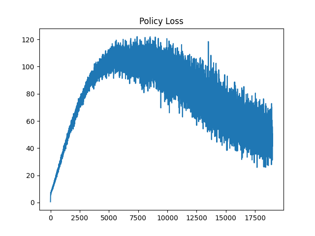
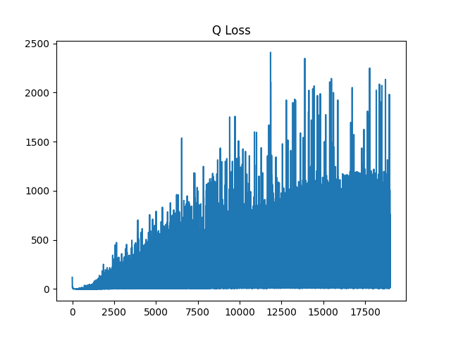
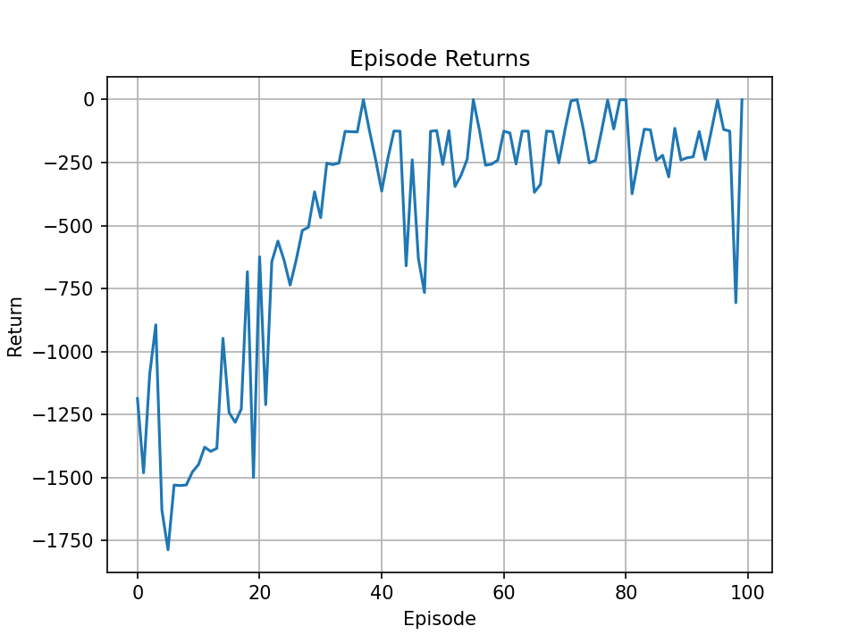
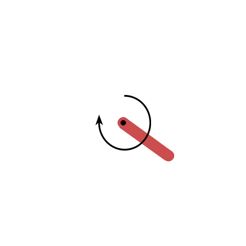
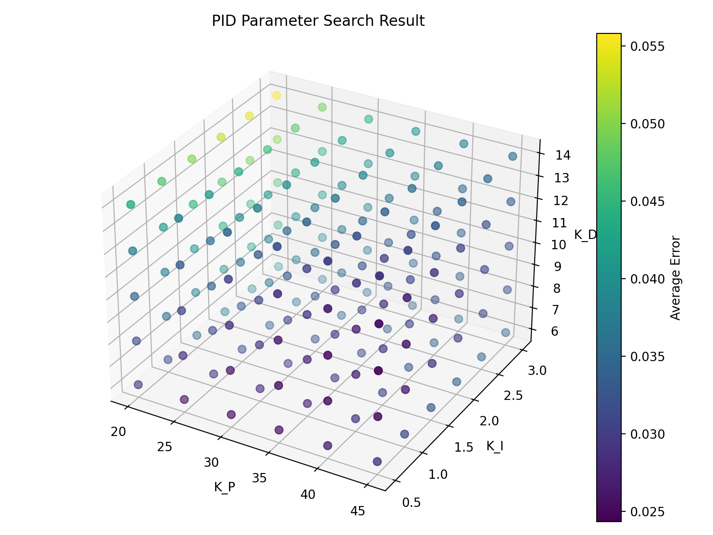

# 🧠 Pendulum Control Suite (DDPG & PID)

本项目包含基于强化学习 (DDPG) 与经典控制 (PID) 的 **摆杆控制实验**，支持 `gymnasium` 与旧版 `gym` 环境。
项目包括：
- DDPG 智能体的训练与评估
- PID 控制器手动控制与自动调参
- 可视化绘图、GIF 输出与多线程参数搜索

---

## 📁 文件结构

```
├── ddpg_pendulum-v0.py       # DDPG 强化学习实现（支持 Gymnasium）
├── pid_control_chatgpt.py    # PID 控制器实时演示
├── pid_control_find.py       # PID 自动调参 + 可视化
├── main.py                   # 简单环境测试 (随机动作)
├── requirements.txt          # 依赖文件
└── runs_pendulum/            # 训练结果输出目录 
└── runs_pid/                 # 人工控制结果输出目录 
```

---

## ⚙️ 环境安装

建议使用 **Python 3.9–3.11** 与 **Anaconda** 环境。

### 方式一：使用 pip 安装依赖
```bash
pip install -r requirements.txt
```

### 方式二：使用 Conda 创建环境
```bash
conda create -n pendulum python=3.10
conda activate pendulum
pip install -r requirements.txt
```

---

## 🚀 运行说明

### 1️⃣ **DDPG 训练 Pendulum 环境**
```bash
python ddpg_pendulum-v0.py --env Pendulum-v1 --episodes 300 --render_eval --save_gif
```

**参数说明：**
| 参数 | 默认值 | 说明 |
|------|--------|------|
| `--env` | `Pendulum-v1` | 环境名称 |
| `--episodes` | `200` | 训练回合数 |
| `--render_eval` | - | 启用评估时实时渲染 |
| `--save_gif` | - | 保存评估动画 GIF |


包括：
- `returns.png`：每回合回报曲线  
- `pi_loss.png`：策略网络损失  
- `q_loss.png`：价值网络损失  
- `eval.gif`：智能体评估动画  

---

### 2️⃣ **PID 手动控制演示**
```bash
python pid_control_chatgpt.py
```
通过固定 PID 参数控制倒立摆，窗口标题实时显示角度、角速度与力矩输出。

可修改代码中：
```python
P = 45.0
I = 0.50
D = 10.0
```
调整控制器性能。

---

## 🧩 主要依赖

| 库 | 功能 | 版本建议 |
|----|------|-----------|
| `torch` | 深度神经网络 | ≥1.10 |
| `gymnasium` | 强化学习环境 | ≥0.29 |
| `pygame` | 实时可视化与窗口渲染 | ≥2.5 |
| `matplotlib` | 绘图与结果展示 | ≥3.7 |
| `imageio` | GIF 生成 | ≥2.31 |
| `numpy` | 数值计算 | ≥1.24 |

---

## 🧠 算法简介

### 🔹 DDPG（Deep Deterministic Policy Gradient）
一种基于 Actor-Critic 架构的连续动作空间强化学习算法：
- **Actor**：输出连续动作  
- **Critic**：评估动作的价值  
- 使用 **目标网络 (Target Network)** 与 **经验回放 (Replay Buffer)** 稳定训练  
- 使用 **OU 噪声 (Ornstein-Uhlenbeck Process)** 增强探索性  

### 🔹 PID 控制
通过比例 (P)、积分 (I)、微分 (D) 三项调节实现平衡控制：
- `u(t) = P * e(t) + I * ∫e(t) dt + D * de(t)/dt`

---

## 📊 示例结果

| 训练类型         | 示例图                                                       |
|--------------|-----------------------------------------------------------|
| DDPG pi_loss |  |
| DDPG q_loss  |   |
| DDPG 训练回报    |  |
| DDPG 评估动画    |     |
| PID 参数搜索     |                  |


